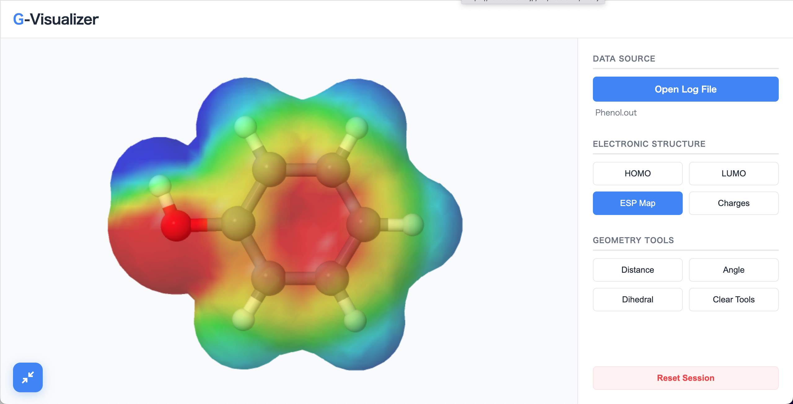

# G-Visualizer

[JSmol](https://jmol.sourceforge.net/)-based molecular visualization tool for GAMESS (US) output files.  

For more details on G-Visualizer, please go to https://pc-chem-basics.blog.jp/archives/38060058.html
